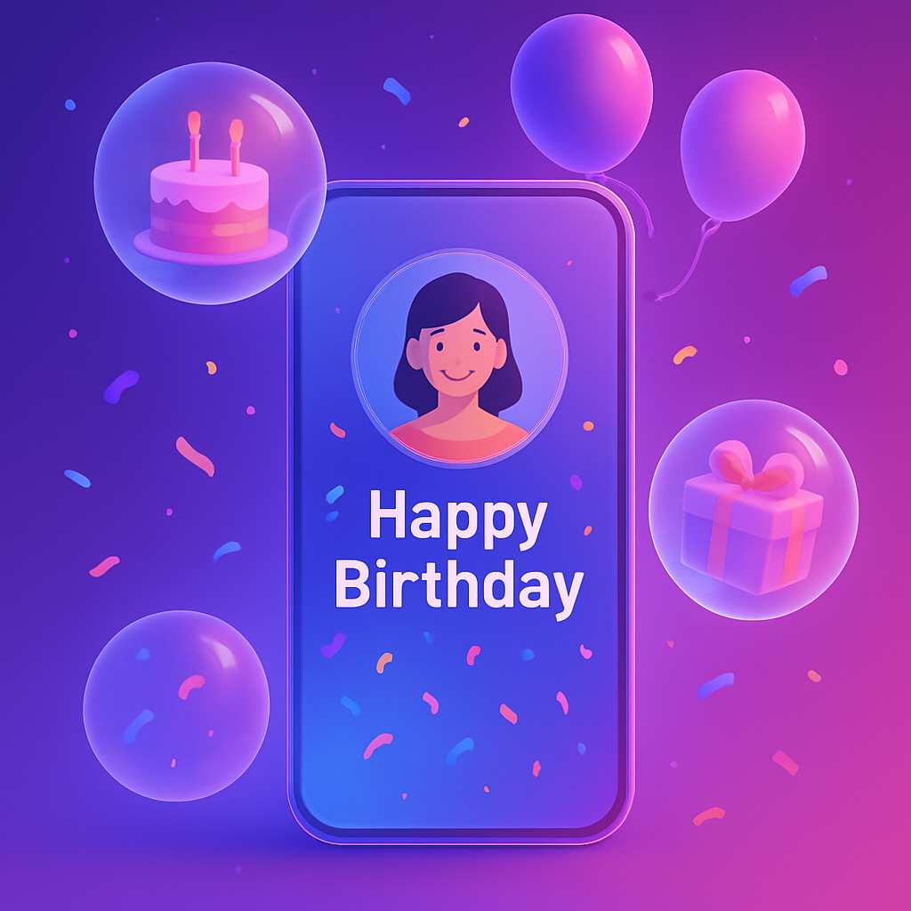

🌟 **Birthday Magic: Personalized Celebration Creator** 🎂🎉

## 🎈 **Project Description**

**Birthday Magic** is a stunning, interactive web application that lets you create **personalized birthday celebration pages** with just a few clicks! This beautiful **glassmorphism-style** website transforms simple inputs into magical digital birthday cards complete with:

- ✨ **Personalized name displays**
- 📸 **Photo uploads** of the birthday person
- 🎉 **Animated celebration GIFs**
- 💌 **Customizable birthday messages**
- 🔗 **Unique, shareable URLs**

Built with pure **HTML5, CSS3, and JavaScript**, this project showcases modern web design techniques with:

- **Glassmorphism UI** with frosted glass effects
- **Responsive design** that works on all devices
- **Client-side storage** for instant card generation
- **Beautiful animations** and transitions
- **Share functionality** for social media

## 🎯 **Purpose & Vision**

Tired of generic birthday messages? Birthday Magic solves the problem of **impersonal digital greetings** by allowing anyone to create:

1. **Unique digital celebrations** in minutes
2. **Personalized keepsakes** that can be saved and revisited
3. **Shareable moments** that spread joy across social media
4. **Template-based designs** that require zero design skills

Perfect for **friends, family, coworkers**, or anyone who wants to make birthdays extra special!

## 💻 **Technical Highlights**

```javascript
// Modern ES6 JavaScript
const celebrationGIFs = [
  'https://media.giphy.com/media/l0HU7JI1uOlMnKfQ4/giphy.gif',
  // More festive GIFs...
];

// Glassmorphism CSS
.glass-card {
  background: rgba(255, 255, 255, 0.2);
  backdrop-filter: blur(10px);
  border: 1px solid rgba(255, 255, 255, 0.3);
}
```

- **Pure frontend implementation** (no backend required)
- **LocalStorage API** for client-side data persistence
- **FileReader API** for image previews
- **Responsive design** with mobile-first approach
- **Web Share API** integration for social sharing

